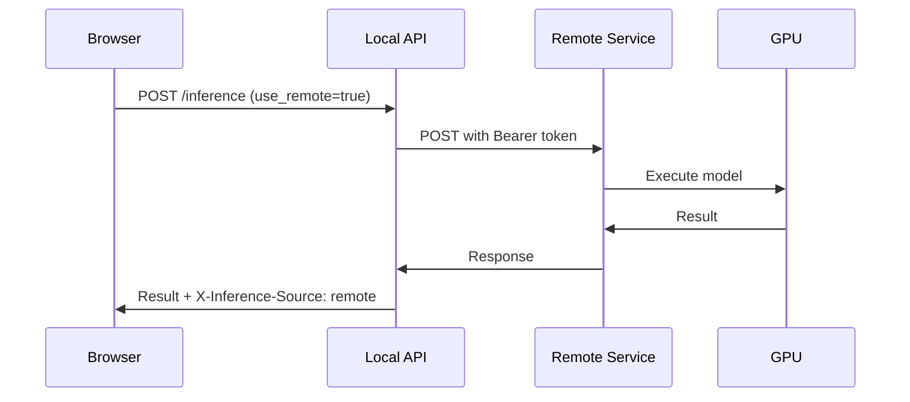

# 🚀 Remote Inference Integration - Quick Start

**Status**: ✅ Implementation Complete  
**Date**: October 15, 2025

## What This Does

Allows your local HF Inference app to forward requests to a remote GPU cluster at:
```
https://inference.kube.megazord.studio/inference
```

This means you can run heavy models without needing local GPU/RAM!

## Setup (30 seconds)

```bash
# 1. Set environment variables
export REMOTE_INFERENCE_ENABLED=true
export REMOTE_INFERENCE_TOKEN=SUPERSECRET

# 2. Restart server (if already running)
# Press Ctrl+C in the terminal running uvicorn, then:
.venv/bin/python -m uvicorn app.main:app --reload

# 3. Hard refresh browser
# Open http://127.0.0.1:8000/ and press Ctrl+Shift+R
```

## Usage

### Option A: UI (Easiest)

1. Go to http://127.0.0.1:8000/
2. Select a task (e.g., "text-generation")
3. Click "RUN" on any model
4. **Check the box**: ☑ "Use remote inference service"
5. Fill in your prompt/files
6. Click "Run inference"
7. Watch it execute on remote GPU!

### Option B: Python Script

```python
import requests
import json

url = "http://127.0.0.1:8000/inference"

files = {
    "spec": (None, json.dumps({
        "model_id": "google/gemma-2-2b-it",
        "task": "text-generation",
        "payload": {"prompt": "Hello!"}
    }), "application/json"),
    "use_remote": (None, "true", "text/plain"),
}

response = requests.post(url, files=files)
print(response.json())
```

### Option C: Test Script

```bash
.venv/bin/python test_remote_inference.py
```

## Test It Now!

```bash
# Quick test with curl
curl -X POST http://127.0.0.1:8000/inference \
  -F 'spec={"model_id":"google/gemma-2-2b-it","task":"text-generation","payload":{"prompt":"Hello world"}}' \
  -F 'use_remote=true' \
  2>&1 | grep -A5 '"'
```

Expected output:
```json
{
  "generated_text": "Hello world! How can I assist you today?..."
}
```

## Verify It's Working

Check the response headers in browser DevTools:
```
X-Inference-Source: remote  ← Should say "remote" not "local"
```

## Files to Review

- 📖 **REMOTE_INFERENCE.md** - Full documentation
- 📋 **REMOTE_INFERENCE_IMPLEMENTATION.md** - Technical details
- 🎨 **REMOTE_INFERENCE_UI.md** - UI preview
- 🧪 **test_remote_inference.py** - Test script
- ⚙️ **setup_remote.sh** - Environment setup helper

## Architecture

```
Browser → Local API (FastAPI) → Remote GPU Cluster
                ↓
          (or local CPU)
```

## Key Features

✅ Toggle in UI (checkbox)  
✅ Automatic fallback for unsupported tasks  
✅ Bearer token authentication  
✅ Supports all file types (image, audio, video)  
✅ Response headers indicate source  
✅ Full error handling  

## Troubleshooting

### "Could not connect"
→ Make sure server is running: `.venv/bin/python -m uvicorn app.main:app --reload`

### Checkbox not visible
→ Hard refresh browser: `Ctrl+Shift+R`

### "Remote not configured"
→ Set environment variables:
```bash
export REMOTE_INFERENCE_ENABLED=true
export REMOTE_INFERENCE_TOKEN=SUPERSECRET
```

### "401 Unauthorized"
→ Check token matches the remote service expectations

## What Changed

```
NEW FILES:
  app/services/remote_inference_service.py
  test_remote_inference.py
  setup_remote.sh
  REMOTE_INFERENCE.md
  REMOTE_INFERENCE_IMPLEMENTATION.md
  REMOTE_INFERENCE_UI.md
  QUICKSTART.md (this file)

MODIFIED FILES:
  app/main.py (added use_remote parameter)
  app/templates/inference_modal.html (added checkbox)
  app/static/js/inference.js (send use_remote flag)
  app/static/css/app.css (checkbox styles)
```

## Next Steps

1. ✅ Test in browser with checkbox
2. ✅ Test with Python script
3. ✅ Check DevTools for X-Inference-Source header
4. 📝 Optionally add to ~/.bashrc for permanent config:
   ```bash
   echo 'export REMOTE_INFERENCE_ENABLED=true' >> ~/.bashrc
   echo 'export REMOTE_INFERENCE_TOKEN=SUPERSECRET' >> ~/.bashrc
   ```

## Example Request Flow



## Performance Notes

- **Network latency**: +100-500ms per request
- **GPU acceleration**: Much faster for large models
- **No local memory**: Offload heavy models to cluster
- **Concurrent requests**: Remote service can handle parallel jobs

---

**Ready to go!** 🎉

Just set the env vars, restart the server, refresh the browser, and check that box!
